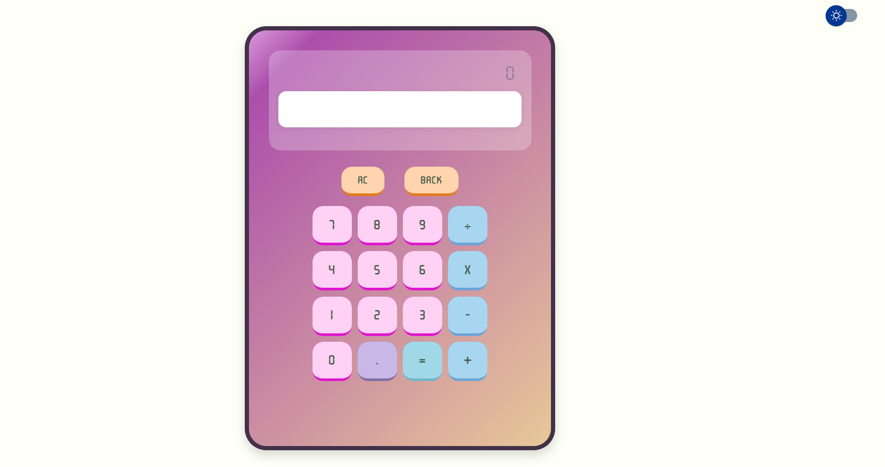
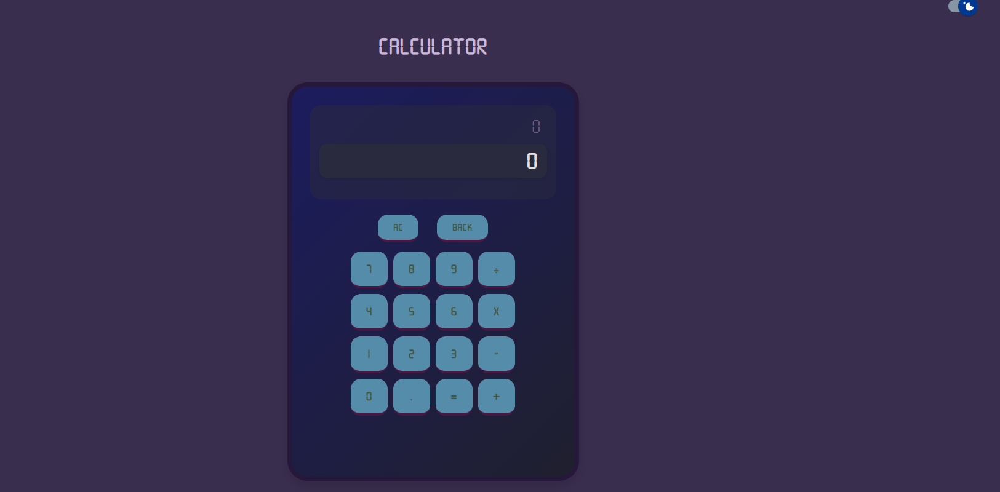

# JavaScript_calculator
## Date:12/16/2025
### By: Jameela Mohammed Saeed
***

#### **Modern Interactive Calculator**
A JavaScript calculator built to do more than basic math. It gives satisfying audio feedback with each button press, lets you switch smoothly between light and dark mood, and uses a dual‑display to show both your operations and results in real time.
You can click through the interface or use full keyboard support! either way, chained operations work naturally. Backspace and clear‑all functions are included for straightforward control.

## Live Demo

**Deplyed** :  
[clicky-calculator](https://clicky-calculator.vercel.app/)

#### **Features**
* **Basic Arithmetic Operations:**  Addition, subtraction, multiplication, and division.
* **Chaining Calculations:** Perform continuous calculations without pressing equals.
* **Dual Display System:** Main display for results and second display showing operation history.
* **Audio Feedback:** Satisfying click sounds for every button press.
* **Theme Toggle:** Switch between light and dark modes.
* **Full Keyboard Support:** Complete keyboard functionality for faster input.
* **Backspace Function:**Delete the last digit entered.
* **Clear All:** Reset the calculator completely.
* **Division by Zero Handling:** Prevents errors with helpful messages.

### Keyboard support shortcuts

* Numbers `0-9`
* Operators `*,/,+,-`
* Decimal `.`
* Equal `Enter` or `=`
* BackSpace `backspace`
* ClearAll `Escape` or `c`

#### ***Technologies used***
  * HTML
  * CSS
  * JS
  *  Uiverse.io
  *  VS code

